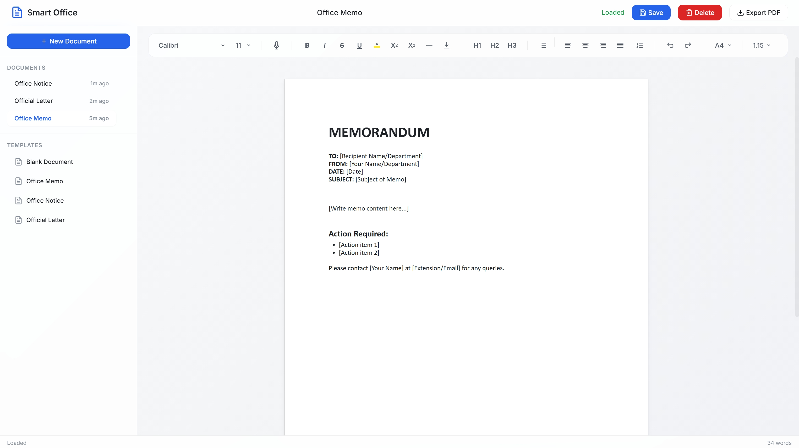

# Smart Office

Offline document editor that runs on a local network. No cloud, no internet, no external dependencies.

## What Is This?

A browser-based document editor (like Google Docs) that runs entirely on your own server. Built for offices that can't use cloud tools due to security policies.



## Quick Start

```bash
# You need Bun installed (https://bun.sh)
bun install
bun run dev
```

Open <http://localhost:3000>

## Features

- **Rich text editing** - Bold, italic, headings, lists, alignment
- **Font controls** - Family (Arial, Calibri, etc.) and size (8-72px)
- **Templates** - Pre-made document formats (letters, memos)
- **Voice dictation** - Click mic, speak, text appears (Web Speech API for POC)
- **PDF export** - Download as PDF
- **Auto-save** - Saves after you stop typing
- **Document Locking** - Prevents colleagues from overwriting your work

## How It Works

```text
Browser <---> Bun Server <---> SQLite (WAL)
```

That's it. Server serves the editor and handles document storage. Documents are stored in `data/smart_office.sqlite`.

## Project Structure

```text
src/
  client/       # Frontend (HTML, CSS, TypeScript)
  server/       # Backend (Hono API routes)
templates/      # Document templates
data/           # Saved documents (git-ignored)
docs/           # Design documentation
```

## API

| Method | Endpoint           | What it does       |
| ------ | ------------------ | ------------------ |
| GET    | /api/documents     | List all documents |
| POST   | /api/documents     | Create document    |
| GET    | /api/documents/:id | Get one document   |
| PUT    | /api/documents/:id | Update document    |
| DELETE | /api/documents/:id | Delete document    |
| GET    | /api/templates     | List templates     |
| GET    | /api/templates/:id | Get template       |

## Tech Stack

- **Runtime**: Bun (could swap for Node.js)
- **Server**: Hono (Express-like, smaller)
- **Editor**: TipTap (headless, JSON-based)
- **Storage**: SQLite (WAL Mode) - ACID compliant
- **Auth**: Basic `X-User-ID` tracking

## Known Limitations

1. **Voice only works in Chrome/Edge** - Firefox requires the Server-side Whisper upgrade (Architecture V2)
2. **Locking is Pessimistic** - You must close the tab to unlock immediately (or wait 30s)
3. **PDF is basic** - Complex formatting might not render perfectly
4. **No search** - Would need a database for that
5. **No tests** - Time constraints

## What I'd Improve

If I had more time:

1. Add SQLite for better performance with many documents
2. Document locking so two people don't overwrite each other
3. Version history (undo across sessions)
4. Better PDF export using Puppeteer
5. Actual test coverage

## Documentation

| Document                                                           | Description                                                                      |
| ------------------------------------------------------------------ | -------------------------------------------------------------------------------- |
| [DESIGN_NOTES.md](./DESIGN_NOTES.md)                               | Main design document - technology choices, trade-offs, production considerations |
| [PROBLEM_STATEMENT.md](./PROBLEM_STATEMENT.md)                     | Original requirements and evaluation criteria                                    |
| [docs/01-design-and-approach.md](./docs/01-design-and-approach.md) | Detailed system architecture and component design                                |
| [docs/02-poc-software-design.md](./docs/02-poc-software-design.md) | POC implementation plan and code patterns                                        |

## Running in Production

```bash
bun run start
```

For multi-device access, other machines on the network can use:

```text
http://<your-ip>:3000
```

## Deploying to Render.com

1. Push your code to GitHub
2. Go to [render.com](https://render.com) and create an account
3. Click **New** -> **Web Service**
4. Connect your GitHub repository
5. Render will auto-detect the `render.yaml` and configure everything
6. Click **Deploy**

The app will be live at `https://smart-office-XXXX.onrender.com`

**Note**: Free tier may spin down after 15 min of inactivity. First request after idle takes ~30 seconds.

## License

Built as a technical assessment.
