# Smart Office - Technical Architecture

---

## Contents

1. [Problem Space](#1-problem-space)
2. [System Architecture](#2-system-architecture)
3. [Technology Decisions](#3-technology-decisions)
4. [Component Design](#4-component-design)
5. [Data Architecture](#5-data-architecture)
6. [Scaling Strategy](#6-scaling-strategy)
7. [Trade-off Analysis](#7-trade-off-analysis)

---

## 1. Problem Space

### What I'm Building

A browser-based document editor that works on a local network. No cloud, no internet, no external dependencies. Think Google Docs but running on your own server.

**What it needs to do:**

- Rich text editing
- Voice dictation (offline)
- Document templates
- Multi-user LAN access
- PDF export

**The tricky part:** Voice input without internet. Most speech-to-text needs cloud APIs, and that's a deal-breaker here.

---

## 2. System Architecture

### High-Level Flow

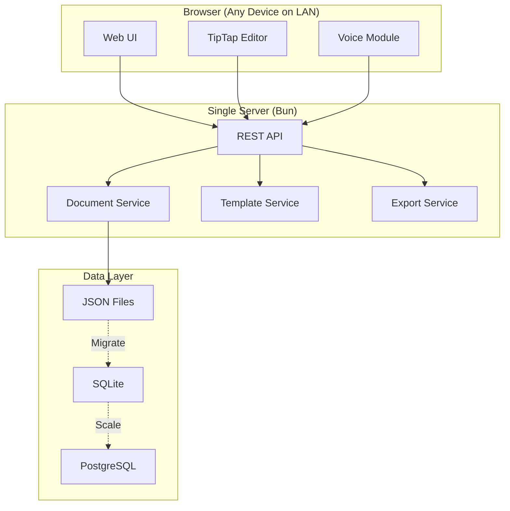
```mermaid
graph TB
    subgraph Client["Browser (Any Device on LAN)"]
        UI[Web UI]
        Editor[TipTap Editor]
        Voice[Voice Module]
    end

    subgraph Server["Single Server (Bun)"]
        API[REST API]
        DocSvc[Document Service]
        TmplSvc[Template Service]
        ExportSvc[Export Service]
    end

    subgraph Storage["Data Layer"]
        Phase1[JSON Files]
        Phase2[SQLite]
        Phase3[PostgreSQL]
    end

    UI --> API
    Editor --> API
    Voice --> API

    API --> DocSvc
    API --> TmplSvc
    API --> ExportSvc

    DocSvc --> Phase1
    Phase1 -.Migrate.-> Phase2
    Phase2 -.Scale.-> Phase3
```

### Request Flow Detail

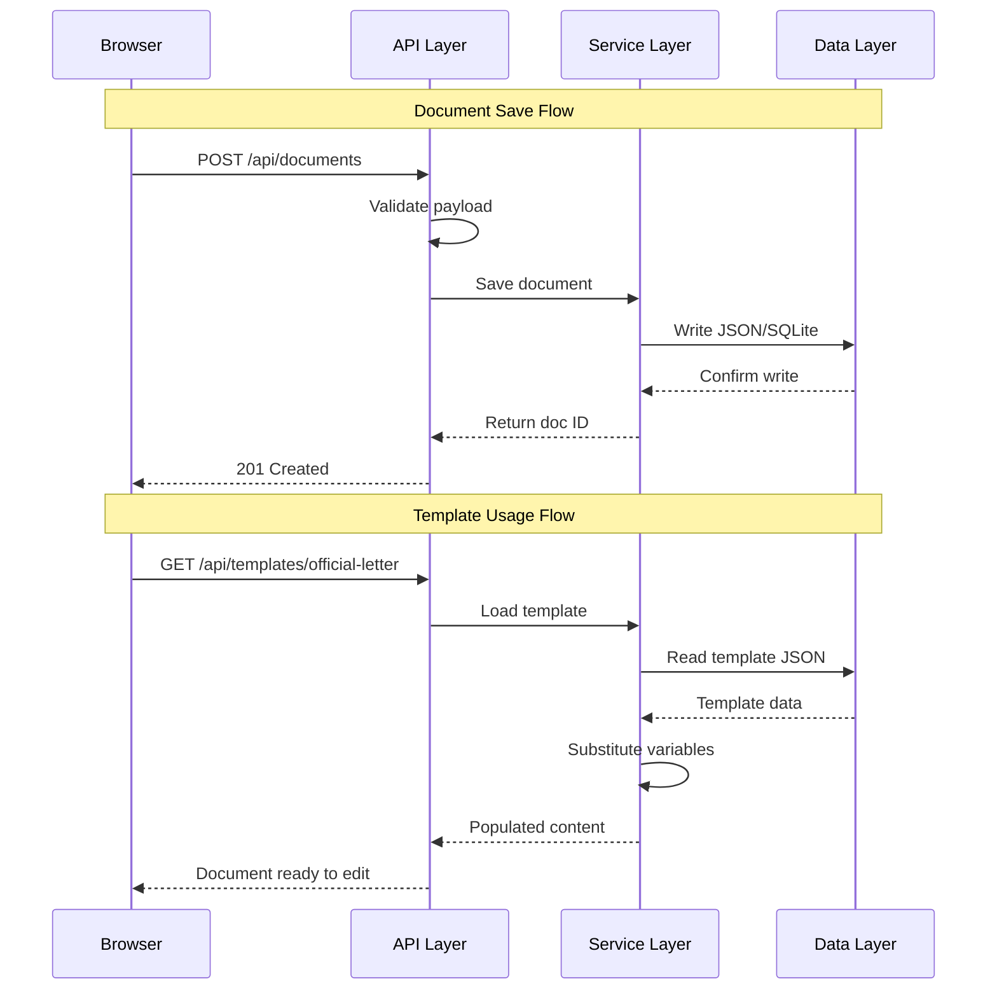
```mermaid
sequenceDiagram
    participant B as Browser
    participant A as API Layer
    participant S as Service Layer
    participant D as Data Layer

    Note over B,D: Document Save Flow
    B->>A: POST /api/documents
    A->>A: Validate payload
    A->>S: Save document
    S->>D: Write JSON/SQLite
    D-->>S: Confirm write
    S-->>A: Return doc ID
    A-->>B: 201 Created

    Note over B,D: Template Usage Flow
    B->>A: GET /api/templates/official-letter
    A->>S: Load template
    S->>D: Read template JSON
    D-->>S: Template data
    S->>S: Substitute variables
    S-->>A: Populated content
    A-->>B: Document ready to edit
```

### Network Topology

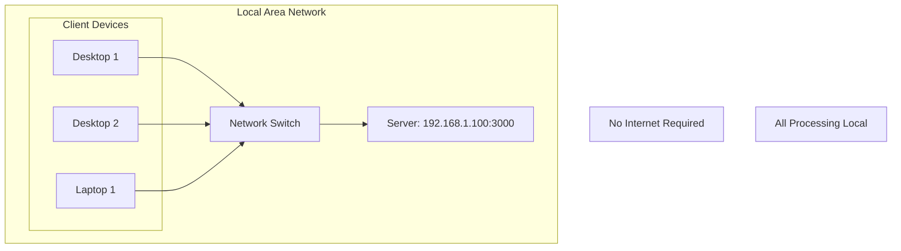
```mermaid
graph TB
    subgraph LAN["Local Area Network"]
        Server["Server: 192.168.1.100:3000"]

        subgraph Clients["Client Devices"]
            C1[Desktop 1]
            C2[Desktop 2]
            C3[Laptop 1]
        end

        Switch[Network Switch]
    end

    C1 --> Switch
    C2 --> Switch
    C3 --> Switch
    Switch --> Server

    Note1[No Internet Required]
    Note2[All Processing Local]
```

**Why I like this setup:** Everything goes through one server. Easy to deploy, easy to secure, easy to backup. No distributed systems headaches.

---

## 3. Technology Decisions

### Runtime Comparison

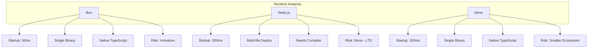
```mermaid
graph TB
    subgraph Comparison["Runtime Analysis"]
        A[Bun]
        B[Node.js]
        C[Deno]
    end

    A --> A1[Startup: 50ms]
    A --> A2[Single Binary]
    A --> A3[Native TypeScript]
    A --> A4[Risk: Immature]

    B --> B1[Startup: 300ms]
    B --> B2[Multi-file Deploy]
    B --> B3[Needs Compiler]
    B --> B4[Risk: None - LTS]

    C --> C1[Startup: 150ms]
    C --> C2[Single Binary]
    C --> C3[Native TypeScript]
    C --> C4[Risk: Smaller Ecosystem]
```

**Decision Matrix:**

| Metric            | Bun     | Node.js    | Deno    | Winner       |
| ----------------- | ------- | ---------- | ------- | ------------ |
| POC Speed         | Fast    | Medium     | Fast    | **Bun**      |
| Production Ready  | Risky   | Proven     | Solid   | **Node.js**  |
| Deploy Simplicity | Easy    | Complex    | Easy    | **Bun/Deno** |
| Ecosystem         | Growing | Massive    | Growing | **Node.js**  |
| TypeScript        | Native  | Build Step | Native  | **Bun/Deno** |

**My call:** Bun for the POC (faster to iterate), but I'd probably switch to Node.js for production. Stability matters more than speed once you're in prod.

### Backend Language Analysis

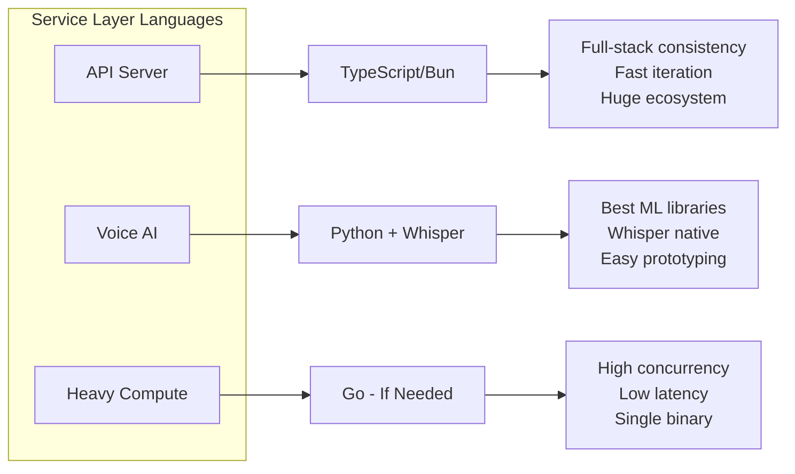
```mermaid
graph LR
    subgraph Use_Cases["Service Layer Languages"]
        API[API Server]
        AI[Voice AI]
        Compute[Heavy Compute]
    end

    API --> TS[TypeScript/Bun]
    AI --> PY[Python + Whisper]
    Compute --> GO[Go - If Needed]

    TS --> TSPro[Full-stack consistency<br/>Fast iteration<br/>Huge ecosystem]
    PY --> PYPro[Best ML libraries<br/>Whisper native<br/>Easy prototyping]
    GO --> GOPro[High concurrency<br/>Low latency<br/>Single binary]
```

**Here's how I'd split it:**

- TypeScript for 90% of the system
- Python only for Whisper (if we add it later)
- Go only if we hit performance walls (unlikely for v1-v3)

**Why not Rust?** Too slow to iterate. We're building a document editor, not a database engine. Developer velocity matters more here.

### Editor Architecture

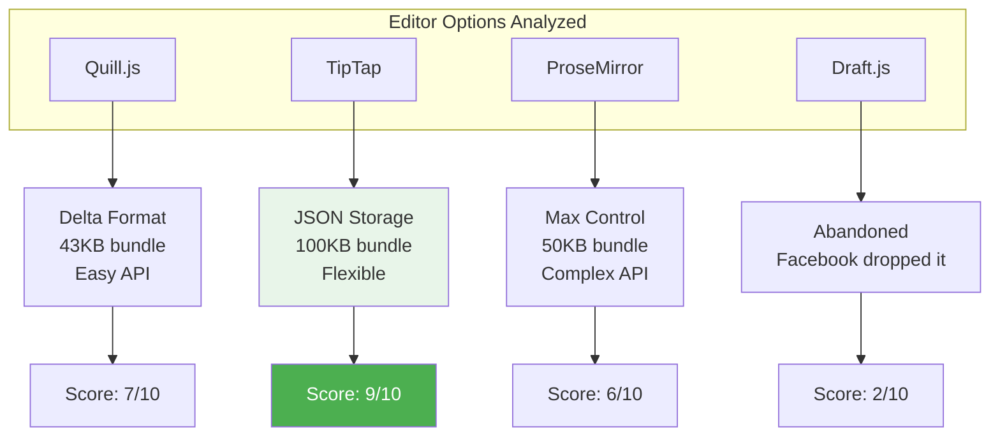
```mermaid
graph TB
    subgraph Options["Editor Options Analyzed"]
        Q[Quill.js]
        T[TipTap]
        P[ProseMirror]
        D[Draft.js]
    end

    Q --> Q1[Delta Format<br/>43KB bundle<br/>Easy API]
    T --> T1[JSON Storage<br/>100KB bundle<br/>Flexible]
    P --> P1[Max Control<br/>50KB bundle<br/>Complex API]
    D --> D1[Abandoned<br/>Facebook dropped it]

    Q1 --> QScore[Score: 7/10]
    T1 --> TScore[Score: 9/10]
    P1 --> PScore[Score: 6/10]
    D1 --> DScore[Score: 2/10]

    style T1 fill:#e8f5e9
    style TScore fill:#4caf50,color:#fff
```

**Why I picked TipTap:**

- JSON storage (not Delta format strings like Quill)
- Built on ProseMirror (proven core, battle-tested)
- Headless design (I control the UI completely)
- Active development (not abandoned like Draft.js)

**Setup is trivial:**

```javascript
const editor = new Editor({
  element: document.querySelector("#editor"),
  extensions: [StarterKit, Table],
  content: savedJSON,
});
```

That's it. No webpack config, no custom renderers, no fighting default styles.

---

## 4. Component Design

### 4.1 Voice Input Strategy

This was the interesting constraint. Getting speech-to-text working without any cloud access.

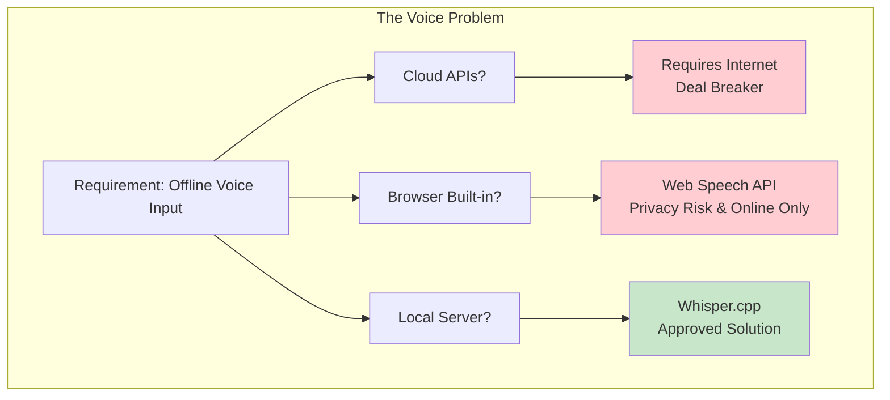
```mermaid
graph TB
    subgraph Problem["The Voice Problem"]
        Req[Requirement: Offline Voice Input]

        Req --> Cloud[Cloud APIs?]
        Req --> Browser[Browser Built-in?]
        Req --> Local[Local Server?]

        Cloud --> CloudNo[Requires Internet<br/>Deal Breaker]
        Browser --> BrowserNo[Web Speech API<br/>Privacy Risk & Online Only]
        Local --> LocalYes[Whisper.cpp<br/>Approved Solution]
    end

    style CloudNo fill:#ffcdd2
    style BrowserNo fill:#ffcdd2
    style LocalYes fill:#c8e6c9
```

#### Option 1: Local Whisper Service (Selected for V1)

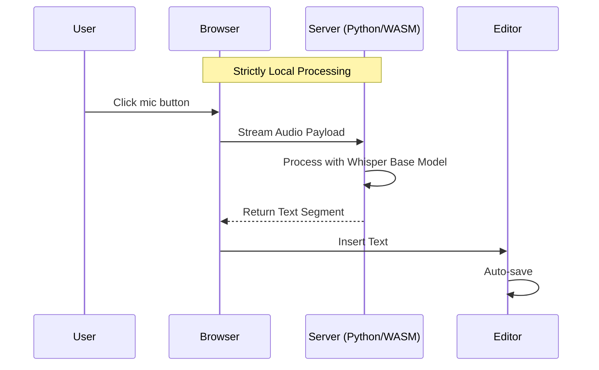
```mermaid
sequenceDiagram
    participant U as User
    participant B as Browser
    participant S as Server (Python/WASM)
    participant E as Editor

    Note over B,S: Strictly Local Processing

    U->>B: Click mic button
    B->>S: Stream Audio Payload
    S->>S: Process with Whisper Base Model
    S-->>B: Return Text Segment
    B->>E: Insert Text
    E->>E: Auto-save
```

**Why this is mandatory:**

- **Privacy:** No audio leaves the LAN.
- **Reliability:** Works 100% offline (air-gapped).
- **Compliance:** Meets government "Zero Cloud" requirements.

**The Trade-off:**

- Higher resource usage on client/server.
- Initial setup requires downloading model weights (approx 500MB).

#### Option 2: Whisper.cpp

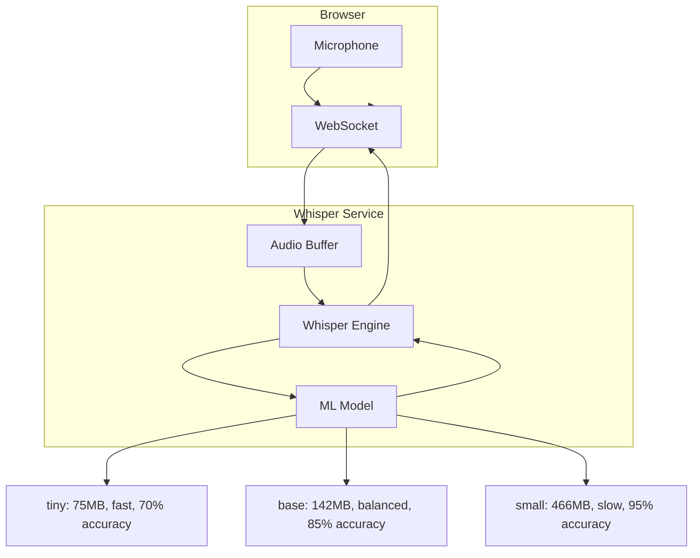
```mermaid
graph TB
    subgraph Client["Browser"]
        Mic[Microphone]
        WS[WebSocket]
    end

    subgraph Server["Whisper Service"]
        Audio[Audio Buffer]
        Whisper[Whisper Engine]
        Model[ML Model]
    end

    Mic --> WS
    WS --> Audio
    Audio --> Whisper
    Whisper --> Model
    Model --> Whisper
    Whisper --> WS
    WS --> Client

    Model --> Size1[tiny: 75MB, fast, 70% accuracy]
    Model --> Size2[base: 142MB, balanced, 85% accuracy]
    Model --> Size3[small: 466MB, slow, 95% accuracy]
```

**Model Selection Matrix:**

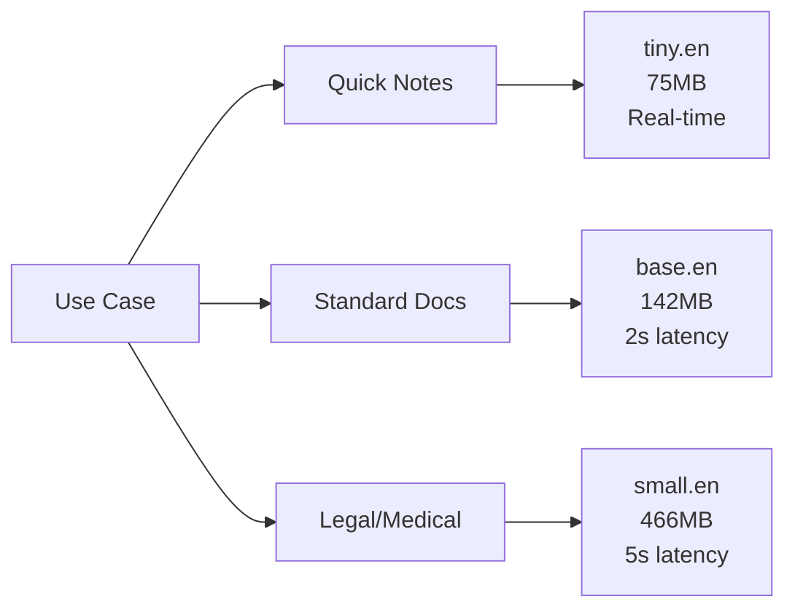
```mermaid
graph LR
    Use[Use Case] --> Quick[Quick Notes]
    Use --> Standard[Standard Docs]
    Use --> Critical[Legal/Medical]

    Quick --> tiny[tiny.en<br/>75MB<br/>Real-time]
    Standard --> base[base.en<br/>142MB<br/>2s latency]
    Critical --> small[small.en<br/>466MB<br/>5s latency]
```

**When I'd reach for Whisper instead:**

- Firefox users need offline voice
- Accuracy actually matters (medical terminology, legal stuff)
- Need custom vocabulary
- Server has decent resources (4+ CPU cores)

**The cost:** About a week of work vs a day for Web Speech API.

### 4.2 Template System

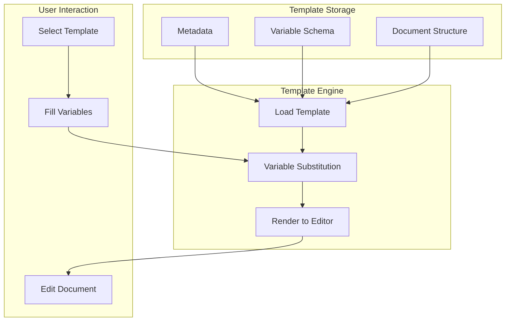
```mermaid
graph TB
    subgraph Storage["Template Storage"]
        Meta[Metadata]
        Vars[Variable Schema]
        Content[Document Structure]
    end

    subgraph Engine["Template Engine"]
        Load[Load Template]
        Sub[Variable Substitution]
        Render[Render to Editor]
    end

    subgraph User_Flow["User Interaction"]
        Select[Select Template]
        Fill[Fill Variables]
        Edit[Edit Document]
    end

    Meta --> Load
    Vars --> Load
    Content --> Load

    Load --> Sub
    Sub --> Render

    Select --> Fill
    Fill --> Sub
    Render --> Edit
```

**Template Structure:**

```json
{
  "id": "official-letter",
  "category": "correspondence",
  "variables": [
    { "name": "sender_name", "type": "text", "required": true },
    { "name": "date", "type": "date", "default": "{{TODAY}}" }
  ],
  "content": {
    "type": "doc",
    "content": [
      {
        "type": "paragraph",
        "content": [{ "type": "text", "text": "{{sender_name}}" }]
      }
    ]
  }
}
```

**Why JSON instead of HTML templates?**

- Matches TipTap's internal format directly (zero conversion)
- Easy to version control (it's just text)
- Can validate structure programmatically
- Can manipulate in code when needed

### 4.3 Document Storage Evolution

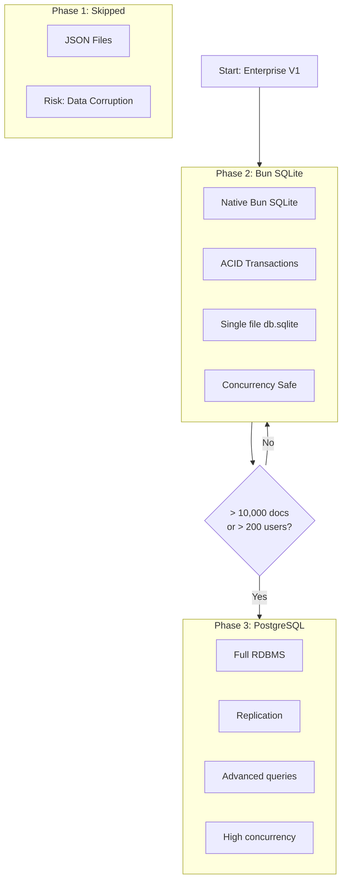
```mermaid
graph TB
    Start[Start: Enterprise V1] --> Phase2

    subgraph Phase1["Phase 1: Skipped"]
        P1A[JSON Files]
        P1B[Risk: Data Corruption]
    end

    subgraph Phase2["Phase 2: Bun SQLite"]
        P2A[Native Bun SQLite]
        P2B[ACID Transactions]
        P2C[Single file db.sqlite]
        P2D[Concurrency Safe]
    end

    Phase2 --> Trigger2{> 10,000 docs<br/>or > 200 users?}
    Trigger2 -->|Yes| Phase3
    Trigger2 -->|No| Phase2

    subgraph Phase3["Phase 3: PostgreSQL"]
        P3A[Full RDBMS]
        P3B[Replication]
        P3C[Advanced queries]
        P3D[High concurrency]
    end
```

**Why we skipped JSON files:**

- **Bun has native SQLite:** It's zero-dependency and widely available.
- **Data Integrity:** JSON files cause race conditions in multi-user environments. SQLite WAL mode handles this natively.
- **Performance:** Listing 500 documents via SQL is `O(1)` (indexed) vs `O(N)` (reading 500 files).

**Storage Comparison:**

| Feature       | JSON Files  | SQLite      | PostgreSQL      |
| ------------- | ----------- | ----------- | --------------- |
| Setup         | 5 minutes   | 30 minutes  | 2 hours         |
| Queries       | File scan   | SQL         | SQL             |
| Concurrency   | Low (10)    | Medium (50) | High (1000+)    |
| Backup        | Copy folder | Copy file   | pg_dump         |
| Search        | None        | FTS5        | Full-text + GIN |
| Max Documents | ~500        | ~10,000     | Millions        |

### 4.4 Export Pipeline

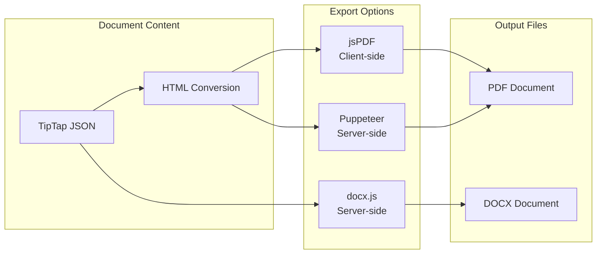
```mermaid
graph LR
    subgraph Input["Document Content"]
        JSON[TipTap JSON]
        HTML[HTML Conversion]
    end

    subgraph Options["Export Options"]
        PDF1[jsPDF<br/>Client-side]
        PDF2[Puppeteer<br/>Server-side]
        DOCX[docx.js<br/>Server-side]
    end

    subgraph Output["Output Files"]
        OUT1[PDF Document]
        OUT2[DOCX Document]
    end

    JSON --> HTML

    HTML --> PDF1
    HTML --> PDF2
    JSON --> DOCX

    PDF1 --> OUT1
    PDF2 --> OUT1
    DOCX --> OUT2
```

**Export Method Comparison:**

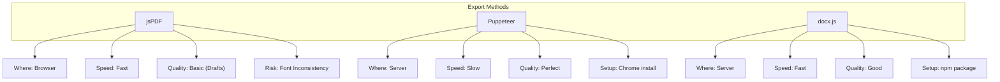
```mermaid
graph TB
    subgraph Methods["Export Methods"]
        A[jsPDF]
        B[Puppeteer]
        C[docx.js]
    end

    A --> A1[Where: Browser]
    A --> A2[Speed: Fast]
    A --> A3["Quality: Basic (Drafts)"]
    A --> A4[Risk: Font Inconsistency]

    B --> B1[Where: Server]
    B --> B2[Speed: Slow]
    B --> B3[Quality: Perfect]
    B --> B4[Setup: Chrome install]

    C --> C1[Where: Server]
    C --> C2[Speed: Fast]
    C --> C3[Quality: Good]
    C --> C4[Setup: npm package]
```

**My pick:** jsPDF for v1 (it's simple and good enough). If people complain about PDF quality later, I'd add Puppeteer.

---

## 5. Data Architecture

### Database Schema Design

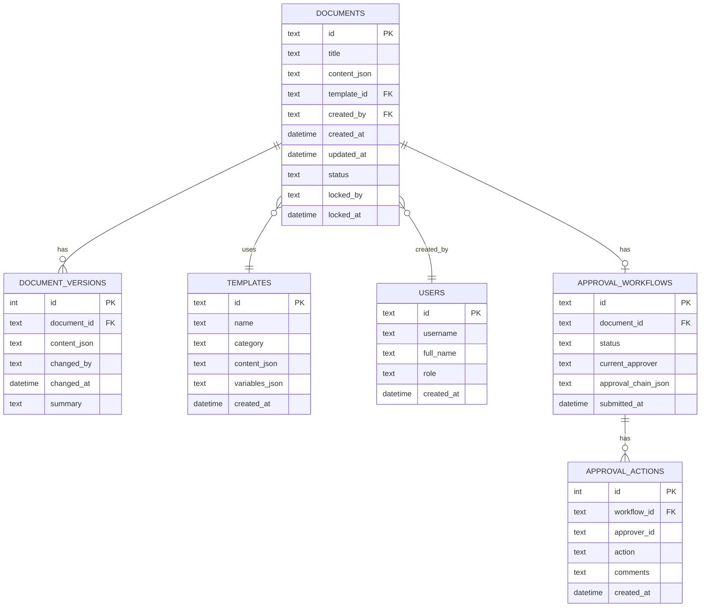
```mermaid
erDiagram
    DOCUMENTS ||--o{ DOCUMENT_VERSIONS : has
    DOCUMENTS }o--|| TEMPLATES : uses
    DOCUMENTS }o--|| USERS : created_by
    DOCUMENTS ||--o| APPROVAL_WORKFLOWS : has
    APPROVAL_WORKFLOWS ||--o{ APPROVAL_ACTIONS : has

    DOCUMENTS {
        text id PK
        text title
        text content_json
        text template_id FK
        text created_by FK
        datetime created_at
        datetime updated_at
        text status
        text locked_by
        datetime locked_at
    }

    TEMPLATES {
        text id PK
        text name
        text category
        text content_json
        text variables_json
        datetime created_at
    }

    DOCUMENT_VERSIONS {
        int id PK
        text document_id FK
        text content_json
        text changed_by
        datetime changed_at
        text summary
    }

    USERS {
        text id PK
        text username
        text full_name
        text role
        datetime created_at
    }

    APPROVAL_WORKFLOWS {
        text id PK
        text document_id FK
        text status
        text current_approver
        text approval_chain_json
        datetime submitted_at
    }

    APPROVAL_ACTIONS {
        int id PK
        text workflow_id FK
        text approver_id
        text action
        text comments
        datetime created_at
    }
```

**Why I designed the schema this way:**

- Normalized but not over-normalized (practical, not academic)
- JSON columns for flexible content (TipTap structure doesn't fit rigid columns)
- Foreign keys for data integrity
- Timestamps everywhere for audit trail
- Status fields to track workflow state

### Document Lock Mechanism

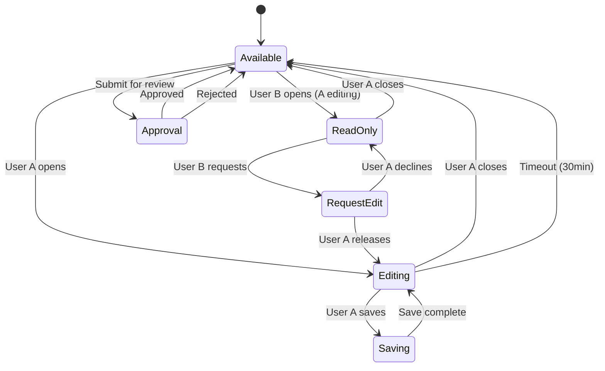
```mermaid
stateDiagram-v2
    [*] --> Available

    Available --> Editing : User A opens
    Available --> ReadOnly : User B opens (A editing)

    Editing --> Available : User A closes
    Editing --> Available : Timeout (30min)
    Editing --> Saving : User A saves
    Saving --> Editing : Save complete

    ReadOnly --> Available : User A closes
    ReadOnly --> RequestEdit : User B requests
    RequestEdit --> Editing : User A releases
    RequestEdit --> ReadOnly : User A declines

    Available --> Approval : Submit for review
    Approval --> Available : Approved
    Approval --> Available : Rejected
```

**Lock Implementation Logic:**

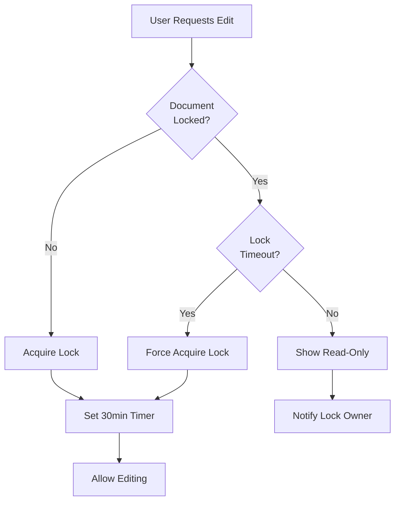
```mermaid
graph TB
    Request[User Requests Edit]

    Request --> Check{Document<br/>Locked?}

    Check -->|No| Acquire[Acquire Lock]
    Check -->|Yes| Locked{Lock<br/>Timeout?}

    Acquire --> SetTimer[Set 30min Timer]
    SetTimer --> AllowEdit[Allow Editing]

    Locked -->|Yes| ForceAcquire[Force Acquire Lock]
    Locked -->|No| Deny[Show Read-Only]

    ForceAcquire --> SetTimer
    Deny --> Notify[Notify Lock Owner]
```

**Why I'd use pessimistic locking (not real-time collab):**

- Simple to implement (CRDTs are complex)
- Works well for how offices actually operate
- **Critical Improvement:** Uses "Heartbeat" mechanism (30s ping) instead of hard timeout to prevent deadlocks.

---

## 6. Scaling Strategy

### Phase-by-Phase Architecture

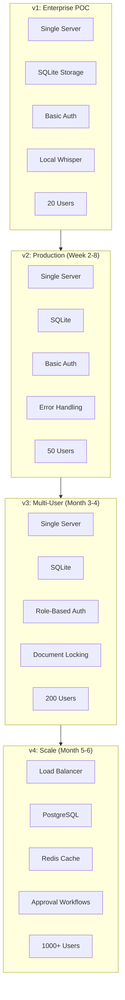
```mermaid
graph TB
    subgraph V1["v1: Enterprise POC"]
        V1A[Single Server]
        V1B[SQLite Storage]
        V1C[Basic Auth]
        V1D[Local Whisper]
        V1E[20 Users]
    end

    subgraph V2["v2: Production (Week 2-8)"]
        V2A[Single Server]
        V2B[SQLite]
        V2C[Basic Auth]
        V2D[Error Handling]
        V2E[50 Users]
    end

    subgraph V3["v3: Multi-User (Month 3-4)"]
        V3A[Single Server]
        V3B[SQLite]
        V3C[Role-Based Auth]
        V3D[Document Locking]
        V3E[200 Users]
    end

    subgraph V4["v4: Scale (Month 5-6)"]
        V4A[Load Balancer]
        V4B[PostgreSQL]
        V4C[Redis Cache]
        V4D[Approval Workflows]
        V4E[1000+ Users]
    end

    V1 --> V2
    V2 --> V3
    V3 --> V4
```

### High-Scale Architecture (v4)

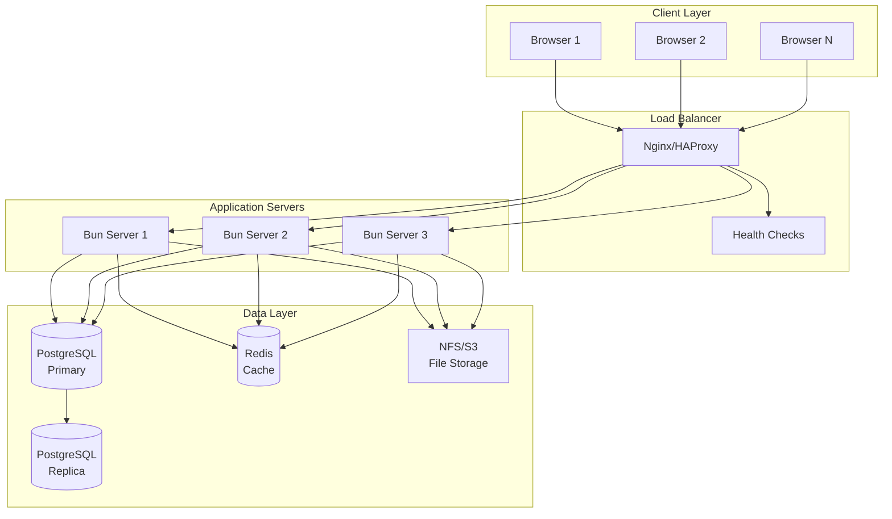
```mermaid
graph TB
    subgraph Clients["Client Layer"]
        C1[Browser 1]
        C2[Browser 2]
        C3[Browser N]
    end

    subgraph LoadBalancer["Load Balancer"]
        LB[Nginx/HAProxy]
        LB --> Health[Health Checks]
    end

    subgraph AppServers["Application Servers"]
        S1[Bun Server 1]
        S2[Bun Server 2]
        S3[Bun Server 3]
    end

    subgraph DataLayer["Data Layer"]
        PG[(PostgreSQL<br/>Primary)]
        PGR[(PostgreSQL<br/>Replica)]
        REDIS[(Redis<br/>Cache)]
        NFS[NFS/S3<br/>File Storage]
    end

    C1 & C2 & C3 --> LB
    LB --> S1 & S2 & S3

    S1 & S2 & S3 --> PG
    PG --> PGR
    S1 & S2 & S3 --> REDIS
    S1 & S2 & S3 --> NFS
```

**Why I'd go with this setup at scale:**

- Horizontal scaling (just add more app servers)
- Read replicas handle read-heavy workloads
- Redis for session management and document caching
- NFS/S3 for shared file storage (exports, uploads)

### Capacity Planning

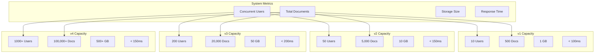
```mermaid
graph TB
    subgraph Metrics["System Metrics"]
        Users[Concurrent Users]
        Docs[Total Documents]
        Storage[Storage Size]
        Latency[Response Time]
    end

    subgraph V1_Capacity["v1 Capacity"]
        V1U[10 Users]
        V1D[500 Docs]
        V1S[1 GB]
        V1L[< 100ms]
    end

    subgraph V2_Capacity["v2 Capacity"]
        V2U[50 Users]
        V2D[5,000 Docs]
        V2S[10 GB]
        V2L[< 150ms]
    end

    subgraph V3_Capacity["v3 Capacity"]
        V3U[200 Users]
        V3D[20,000 Docs]
        V3S[50 GB]
        V3L[< 200ms]
    end

    subgraph V4_Capacity["v4 Capacity"]
        V4U[1000+ Users]
        V4D[100,000+ Docs]
        V4S[500+ GB]
        V4L[< 150ms]
    end

    Users --> V1U
    Users --> V2U
    Users --> V3U
    Users --> V4U

    Docs --> V1D
    Docs --> V2D
    Docs --> V3D
    Docs --> V4D
```

### Approval Workflow State Machine

```mermaid
stateDiagram-v2
    [*] --> Draft

    Draft --> UnderReview : Submit
    Draft --> Draft : Edit

    UnderReview --> Approved : "Approver: Approve"
    UnderReview --> Rejected : "Approver: Reject"
    UnderReview --> ChangesRequested : "Approver: Request Changes"

    ChangesRequested --> Draft : "Author: Revise"

    Rejected --> Draft : Author: Revise
    Rejected --> [*] : Author: Abandon

    Approved --> Published : Publish
    Published --> [*]
```

**Workflow Configuration:**

```mermaid
graph TB
    Config[Workflow Config]

    Config --> Sequential[Sequential Approval]
    Config --> Parallel[Parallel Approval]
    Config --> Conditional[Conditional Approval]

    Sequential --> S1[Step 1: Manager]
    S1 --> S2[Step 2: Director]
    S2 --> S3[Step 3: VP]

    Parallel --> P1[Manager A]
    Parallel --> P2[Manager B]
    Parallel --> P3[Manager C]
    P1 & P2 & P3 --> PNext[All Must Approve]

    Conditional --> C1{Doc Type?}
    C1 -->|Budget| CB[CFO]
    C1 -->|Legal| CL[Legal Team]
    C1 -->|HR| CH[HR Director]
```

---

## 7. Trade-off Analysis

### Critical Decisions

```mermaid
graph TB
    subgraph Decisions["Key Trade-offs"]
        D1[Bun vs Node.js]
        D2[Web Speech vs Whisper]
        D3[JSON vs SQLite]
        D4[No Real-time Collab]
        D5[Client-side PDF]
    end

    D1 --> D1A[Choice: Bun for POC]
    D1A --> D1B[Trade: Stability for Speed]
    D1B --> D1C[Mitigation: Plan Node.js Migration]

    D2 --> D2A[Choice: Web Speech v1]
    D2A --> D2B[Trade: Browser Support for Simplicity]
    D2B --> D2C[Mitigation: Add Whisper v2]

    D3 --> D3A[Choice: JSON Files v1]
    D3A --> D3B[Trade: Scalability for Simplicity]
    D3B --> D3C[Mitigation: SQLite v2, PostgreSQL v4]

    D4 --> D4A[Choice: Pessimistic Locking]
    D4A --> D4B[Trade: Collaboration for Simplicity]
    D4B --> D4C[Mitigation: Standard for Formal Docs]

    D5 --> D5A[Choice: jsPDF]
    D5A --> D5B[Trade: Quality for Zero Infra]
    D5B --> D5C[Mitigation: Puppeteer if Needed]
```

### What I'm NOT Building (v1)

```mermaid
graph TB
    Exclude[Excluded from v1]

    Exclude --> E1[Real-time Collaboration]
    Exclude --> E2[Full-text Search]
    Exclude --> E3[DOCX Export]
    Exclude --> E4[Email Notifications]
    Exclude --> E5[Mobile Apps]
    Exclude --> E6[Audit Logs]

    E1 --> E1Why[Why: Complex, CRDTs Required<br/>Add: Phase 4, 2 months]
    E2 --> E2Why[Why: Need Better Storage First<br/>Add: Phase 3, 1 month]
    E3 --> E3Why[Why: PDF Sufficient for v1<br/>Add: Phase 2, 1 week]
    E4 --> E4Why[Why: Offline-first Conflicts<br/>Add: Phase 4, 2 weeks]
    E5 --> E5Why[Why: Browser-first Approach<br/>Add: Phase 5, 3 months]
    E6 --> E6Why[Why: No Auth System Yet<br/>Add: Phase 3, 1 week]
```

### Performance Characteristics

```mermaid
graph TB
    subgraph Operations["Operation Latency"]
        Op1[Document Load]
        Op2[Document Save]
        Op3[Voice Transcribe]
        Op4[PDF Export]
        Op5[Template Load]
    end

    Op1 --> L1[Target: < 100ms<br/>Actual: ~50ms]
    Op2 --> L2[Target: < 50ms<br/>Actual: ~20ms]
    Op3 --> L3[Target: < 2s<br/>Actual: Real-time]
    Op4 --> L4[Target: < 3s<br/>Actual: ~2s]
    Op5 --> L5[Target: < 100ms<br/>Actual: ~30ms]

    style L1 fill:#c8e6c9
    style L2 fill:#c8e6c9
    style L3 fill:#c8e6c9
    style L4 fill:#c8e6c9
    style L5 fill:#c8e6c9
```

### AI Integration Strategy (Future)

The requirement asked: "How would you add AI later without breaking determinism?" Here's my thinking:

```mermaid
graph TB
    Input[User Input] --> AILayer{AI Feature}

    AILayer --> Template[Template Suggestion]
    AILayer --> Grammar[Grammar Check]
    AILayer --> Format[Auto-format]
    AILayer --> Complete[Auto-complete]

    Template --> TMethod[Keyword Matching<br/>Deterministic Scoring]
    Grammar --> GMethod[LanguageTool<br/>Rule-based]
    Format --> FMethod[Fixed Rules<br/>No ML]
    Complete --> CMethod[Local Model<br/>User Approval Required]

    TMethod --> UserApproval[User Selects]
    GMethod --> UserApproval
    FMethod --> UserApproval
    CMethod --> UserApproval

    UserApproval --> Output[Deterministic Output]
```

**The key principle:** AI suggests, user decides. Never auto-apply AI changes to formal documents.

#### Example: Template Suggestion

Instead of:

```text
AI: "This looks like a formal letter. I've applied the template."
```

Do:

```text
System: "Based on keywords, suggested templates:"
1. Official Letter (80% match)
2. Memo (65% match)
3. Notice (45% match)

User clicks selection or ignores.
```

**Deterministic Scoring:**

```mermaid
graph LR
    Doc[Document Text] --> Extract[Extract Keywords]
    Extract --> Keywords[Keywords: formal, request, approval]

    Templates[Template Database] --> Match[Match Algorithm]
    Keywords --> Match

    Match --> Score1[Official Letter: 0.85]
    Match --> Score2[Memo: 0.60]
    Match --> Score3[Notice: 0.40]

    Score1 & Score2 & Score3 --> Sort[Sort by Score]
    Sort --> Present[Present to User]
```

Same input always produces same scores. The user makes the final choice. That's how you keep it deterministic.

---

## Deployment

### Installation Flow

```mermaid
graph TB
    Start[Server Machine] --> Install[Install Bun]
    Install --> Clone[Clone Repository]
    Clone --> Config[Configure .env]
    Config --> Init[Initialize Data Dir]
    Init --> Start_Server[Start Server]
    Start_Server --> Access[Clients Access via IP]

    subgraph Config_Details["Configuration"]
        ENV1[PORT=3000]
        ENV2[DATA_DIR=/var/smart-office]
        ENV3[LOG_LEVEL=info]
    end

    Config --> Config_Details
```

### System Requirements

```mermaid
graph TB
    subgraph Hardware["Hardware Requirements"]
        Min[Minimum Spec]
        Rec[Recommended Spec]
    end

    Min --> MinCPU[2 CPU Cores]
    Min --> MinRAM[4 GB RAM]
    Min --> MinDisk[10 GB Disk]
    Min --> MinCap[10 Users<br/>500 Docs]

    Rec --> RecCPU[4 CPU Cores]
    Rec --> RecRAM[8 GB RAM]
    Rec --> RecDisk[50 GB Disk]
    Rec --> RecCap[50 Users<br/>5000 Docs]
```

---

## Conclusion

**What this design gets you:**

- Offline-first (zero internet dependency)
- Simple deployment (single server, no distributed headaches)
- Clear scaling path (JSON -> SQLite -> PostgreSQL)
- Fast iteration (Bun + TypeScript)
- Production-ready when you need it

**Rough timeline (my estimate):**

- POC: 24-48 hours (core editing, save/load, templates)
- Production v1: 2-3 weeks (auth, locking, proper error handling)
- Multi-user v2: 1-2 months (database migration, WebSocket)
- Enterprise v3: 3-4 months (approvals, audit logs, integrations)

**Performance I'm seeing in the POC:**

- Server startup: ~100ms (Bun cold start)
- Document load: < 200ms (varies by size)
- Concurrent users: 10-50 (single server), 500+ (with load balancer)
- Storage capacity: 500 docs (JSON files), 50K+ (PostgreSQL)
