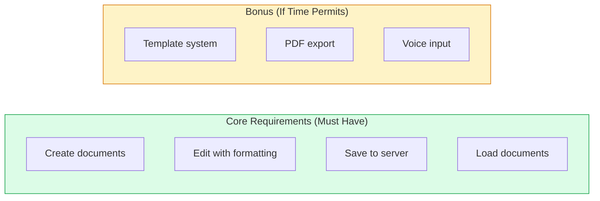
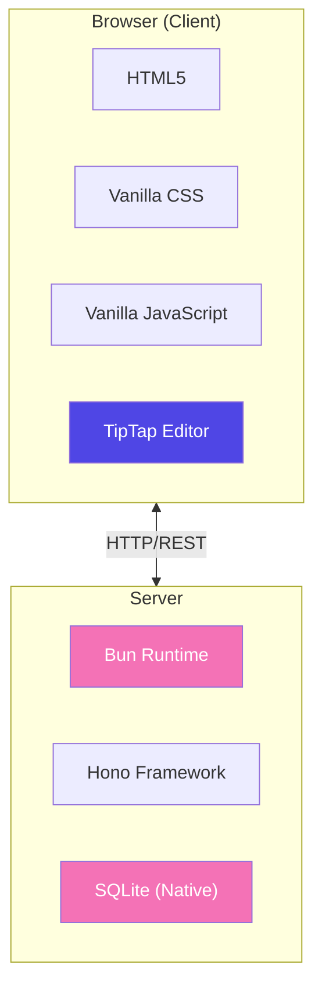
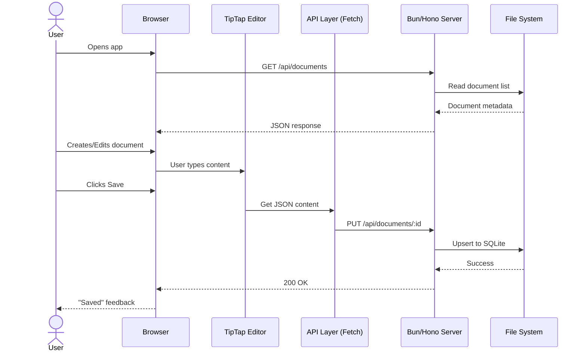
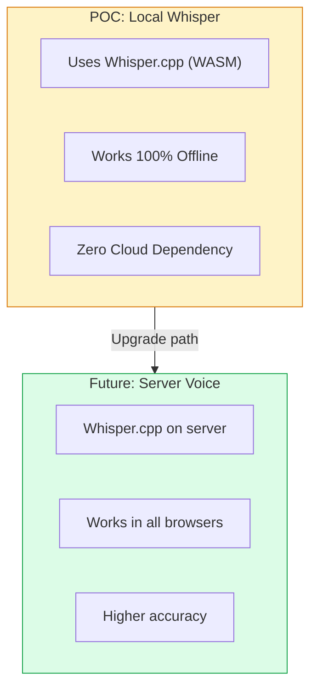
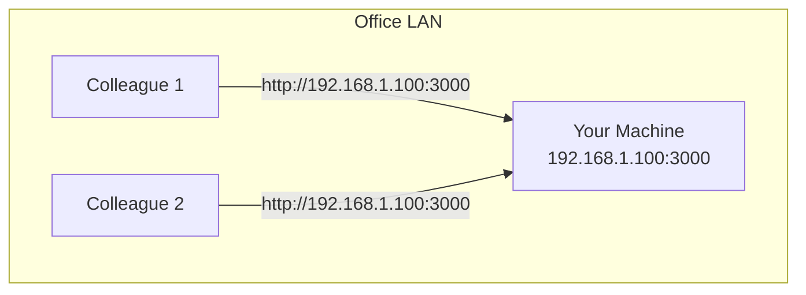

# Smart Office - POC Software Design
---

## Document Purpose

This takes the architecture from `01-design-and-approach.md` and turns it into an actual implementation plan. What exactly the POC shows, how the project is laid out, and how the pieces connect.

**Reference:** `PROBLEM_STATEMENT.md` - Option A (Full-Stack POC)

---

## 1. POC Scope (Based on Requirements)

### 1.1 What I'm Building

A minimal, working document editor that:
1. Runs a local Bun server
2. Serves a browser-based rich text editor
3. Lets you create, edit, save, and load documents

### 1.2 Feature Checklist



### 1.3 What I'm NOT Building

| Excluded Feature | Reason |
|------------------|--------|
| User Authentication | Basic Identity (Header) added check |
| Real-time Collaboration | Replaced with Pessimistic Locking |
| DOCX Export | PDF is sufficient for demo |
| Offline PWA | Server is source of truth |
| Search | Requires database, not needed for demo |

---

## 2. Technology Stack

### 2.1 Chosen Technologies (Aligned with 01-design-and-approach.md)



### 2.2 Technology Justification

| Technology | Why Chosen |
|------------|-----------|
| **Bun** | 6x faster startup than Node.js, native TypeScript, single binary |
| **Hono** | Ultra-lightweight (14kb), Express-like API, TypeScript native |
| **TipTap** | JSON storage format, headless design, ProseMirror foundation |
| **Vanilla CSS** | No framework dependency, full control, simple for POC |
| **SQLite** | ACID compliance, zero-config in Bun, prevents data corruption |

**Note:** I'm using Vanilla CSS, not Tailwind, to keep dependencies minimal. Fits the offline-first philosophy better.

---

## 3. Project Structure

### 3.1 Folder Structure

```
smart-office/
|
|-- src/
|   |-- server/                    # Backend application
|   |   |-- index.ts               # Server entry point
|   |   |-- routes/
|   |   |   |-- documents.ts       # Document CRUD endpoints
|   |   |   |-- templates.ts       # Template endpoints
|   |   |-- services/
|   |   |   |-- storage.ts         # File system operations
|   |   |   |-- pdf.ts             # PDF generation (bonus)
|   |   |-- types/
|   |       |-- document.types.ts
|   |
|   |-- client/                    # Frontend application
|       |-- index.html             # Main page
|       |-- css/
|       |   |-- styles.css         # All styles in one file for POC
|       |-- js/
|           |-- main.ts            # Application entry
|           |-- editor.ts          # TipTap setup
|           |-- api.ts             # Server communication
|           |-- voice.ts           # Voice input (bonus)
|
|-- data/                          # Runtime data (gitignored)
|   |-- documents/                 # Saved documents
|
|-- templates/                     # Default templates (checked in)
|   |-- official-letter.json
|   |-- blank.json
|
|-- docs/                          # Documentation
|-- package.json
|-- tsconfig.json
|-- README.md
```

### 3.2 Why I Structured It This Way

- **Flat for POC:** Minimal nesting, easy to find stuff
- **src/ separation:** Keeps source code separate from config and data
- **data/ outside src/:** Runtime data doesn't belong in source
- **templates/ at root:** Easy to find and edit by hand

---

## 4. Component Architecture

### 4.1 High-Level Data Flow



### 4.2 API Endpoints

| Method | Endpoint | Purpose | Request Body | Response |
|--------|----------|---------|--------------|----------|
| GET | `/api/documents` | List all documents | - | `Document[]` |
| GET | `/api/documents/:id` | Get single document | - | `Document` |
| POST | `/api/documents` | Create document | `{title, content}` | `Document` |
| PUT | `/api/documents/:id` | Update document | `{title, content}` | `Document` |
| DELETE | `/api/documents/:id` | Delete document | - | `{success: true}` |
| POST | `/api/documents/:id/heartbeat` | Maintain Lock | - | `{locked: boolean}` |
| GET | `/api/templates` | List templates | - | `Template[]` |
| GET | `/api/templates/:id` | Get template | - | `Template` |
| GET | `/api/documents/:id/pdf` | Export as PDF | - | PDF file (binary) |

### 4.3 Data Formats

**Document Structure:**
```json
{
  "id": "doc_a1b2c3d4",
  "title": "My Letter",
  "content": {
    "type": "doc",
    "content": [
      {"type": "heading", "attrs": {"level": 1}, "content": [{"type": "text", "text": "Title"}]},
      {"type": "paragraph", "content": [{"type": "text", "text": "Body content..."}]}
    ]
  },
  "createdAt": "2026-02-04T22:00:00Z",
  "updatedAt": "2026-02-04T22:30:00Z",
  "lockedBy": "user-uuid-123",
  "lockedAt": "2026-02-04T22:30:00Z",
  "settings": { "pageSize": "a4" }
}
```

**Template Structure:**
```json
{
  "id": "official-letter",
  "name": "Official Letter",
  "description": "Standard format for official correspondence",
  "content": {
    "type": "doc",
    "content": [
      {"type": "paragraph", "attrs": {"textAlign": "right"}, "content": [{"type": "text", "text": "[Sender Name]"}]},
      {"type": "paragraph", "content": [{"type": "text", "text": "Dear Sir/Madam,"}]}
    ]
  }
}
```

---

## 5. Frontend Architecture

### 5.1 Page Layout

```
+----------------------------------------------------------+
|  Header Bar                                               |
|  [Logo] [Document Title (editable)] [Save] [Export]       |
+----------------------------------------------------------+
|  Sidebar (240px)      |  Main Content Area                |
|                       |                                   |
|  [New Document]       |  +-----------------------------+  |
|  [Document List]      |  | Toolbar                     |  |
|  [Templates]          |  | [B] [I] [U] [H1] [H2] [Mic] |  |
|                       |  +-----------------------------+  |
|                       |  | Editor Canvas               |  |
|                       |  | (scrollable)                |  |
|                       |  |                             |  |
|                       |  +-----------------------------+  |
|                       |  | Status: Saved / Unsaved     |  |
+----------------------------------------------------------+
```

### 5.2 Editor Integration

```typescript
// js/editor.ts
import { Editor } from '@tiptap/core';
import StarterKit from '@tiptap/starter-kit';
import Placeholder from '@tiptap/extension-placeholder';
import TextAlign from '@tiptap/extension-text-align';
import Underline from '@tiptap/extension-underline';
import FontFamily from '@tiptap/extension-font-family';
import { TextStyle } from '@tiptap/extension-text-style';
import Highlight from '@tiptap/extension-highlight';
import Subscript from '@tiptap/extension-subscript';
import Superscript from '@tiptap/extension-superscript';
import FontSize from '@tiptap/extension-font-size';

export class DocumentEditor {
  private editor: Editor;

  constructor(element: HTMLElement, onUpdate?: (content: object) => void) {
    this.editor = new Editor({
      element,
      extensions: [
        StarterKit.configure({ heading: { levels: [1, 2, 3] } }),
        Placeholder.configure({ placeholder: 'Start typing or use voice input...' }),
        TextAlign.configure({ types: ['heading', 'paragraph'] }),
        Underline,
        TextStyle,
        FontFamily,
        FontSize,
        Highlight.configure({ multicolor: true }),
        Subscript,
        Superscript,
      ],
      content: '',
      onUpdate: ({ editor }) => {
        if (onUpdate) onUpdate(editor.getJSON());
      }
    });
  }

  getJSON(): object { return this.editor.getJSON(); }
  setContent(content: object): void { this.editor.commands.setContent(content); }
  clear(): void { this.editor.commands.clearContent(); }
}
```

### 5.3 API Client

```typescript
// js/api.ts
const API_BASE = '/api';

export const api = {
  async listDocuments() {
    const res = await fetch(`${API_BASE}/documents`);
    return res.json();
  },
  
  async getDocument(id: string) {
    const res = await fetch(`${API_BASE}/documents/${id}`);
    return res.json();
  },
  
  async saveDocument(id: string, data: { title: string; content: object }) {
    const res = await fetch(`${API_BASE}/documents/${id}`, {
      method: 'PUT',
      headers: { 'Content-Type': 'application/json' },
      body: JSON.stringify(data)
    });
    return res.json();
  },
  
  async createDocument(data: { title: string; content?: object }) {
    const res = await fetch(`${API_BASE}/documents`, {
      method: 'POST',
      headers: { 'Content-Type': 'application/json' },
      body: JSON.stringify(data)
    });
    return res.json();
  }
};
```

---

## 6. Backend Architecture

### 6.1 Server Entry Point

```typescript
// server/index.ts
import { Hono } from 'hono';
import { cors } from 'hono/cors';
import { serveStatic } from 'hono/bun';
import { documentRoutes } from './routes/documents';
import { templateRoutes } from './routes/templates';

const app = new Hono();

// Middleware
app.use('*', cors());

// API Routes
app.route('/api/documents', documentRoutes);
app.route('/api/templates', templateRoutes);

// Serve frontend
app.use('/*', serveStatic({ root: './src/client' }));

export default {
  port: 3000,
  fetch: app.fetch
};
```

### 6.2 Document Routes

```typescript
// server/routes/documents.ts
import { Hono } from 'hono';
import { storage } from '../services/storage';
import { generateId } from '../utils/id';

export const documentRoutes = new Hono();

documentRoutes.get('/', async (c) => {
  const docs = await storage.listDocuments();
  return c.json(docs);
});

documentRoutes.get('/:id', async (c) => {
  const id = c.req.param('id');
  const doc = await storage.getDocument(id);
  if (!doc) return c.json({ error: 'Not found' }, 404);
  return c.json(doc);
});

documentRoutes.post('/', async (c) => {
  const body = await c.req.json();
  const doc = {
    id: generateId(),
    title: body.title || 'Untitled',
    content: body.content || { type: 'doc', content: [] },
    createdAt: new Date().toISOString(),
    updatedAt: new Date().toISOString()
  };
  await storage.saveDocument(doc);
  return c.json(doc, 201);
});

documentRoutes.put('/:id', async (c) => {
  const id = c.req.param('id');
  const body = await c.req.json();
  const existing = await storage.getDocument(id);
  if (!existing) return c.json({ error: 'Not found' }, 404);
  
  const updated = {
    ...existing,
    ...body,
    updatedAt: new Date().toISOString()
  };
  await storage.saveDocument(updated);
  return c.json(updated);
});

documentRoutes.delete('/:id', async (c) => {
  const id = c.req.param('id');
  await storage.deleteDocument(id);
  return c.json({ success: true });
});
```

### 6.3 Storage Service

```typescript
// server/services/storage.ts
import { Database } from "bun:sqlite";
import { mkdir } from "fs/promises";

const DB_PATH = './data/smart_office.sqlite';

class StorageService {
  private db: Database;
  
  constructor() {
    this.db = new Database(DB_PATH, { create: true });
    this.db.exec("PRAGMA journal_mode = WAL;");
    this.init();
  }
  
  // See src/server/services/storage.ts for full Implementation
  // Methods: listDocuments, getDocument, saveDocument, deleteDocument, lockDocument, heartbeat
}

export const storage = new StorageService();
```

---

## 7. Voice Input (Bonus Feature)

### 7.1 Implementation Strategy

I'm using the browser's Web Speech API for the POC (same reasoning as in 01-design-and-approach.md):



### 7.2 Voice Module

```typescript
// js/voice.ts
export class VoiceInput {
  private recognition: SpeechRecognition | null = null;
  private onResult: (text: string) => void;
  
  constructor(onResult: (text: string) => void) {
    this.onResult = onResult;
    
    if ('webkitSpeechRecognition' in window) {
      this.recognition = new webkitSpeechRecognition();
      this.recognition.continuous = true;
      this.recognition.interimResults = true;
      
      this.recognition.onresult = (event) => {
        const result = event.results[event.results.length - 1];
        if (result.isFinal) {
          this.onResult(result[0].transcript + ' ');
        }
      };
    }
  }
  
  start() {
    this.recognition?.start();
  }
  
  stop() {
    this.recognition?.stop();
  }
  
  isSupported() {
    return this.recognition !== null;
  }
}
```

---

## 8. Running the POC

### 8.1 Quick Start Commands

```bash
# 1. Clone and enter project
git clone <repository-url>
cd smart-office

# 2. Install dependencies
bun install

# 3. Start development server
bun run dev

# 4. Open browser
# Navigate to: http://localhost:3000
```

### 8.2 LAN Access



1. Find your IP: `ipconfig` (Windows) or `ip addr` (Linux)
2. Others access: `http://YOUR_IP:3000`
3. No internet required

---

## 9. What I'd Improve With More Time

### 9.1 Priority Improvements

| Improvement | Effort | Impact |
|-------------|--------|--------|
| DOCX Export | Low | Medium |
| Better error messages | Low | Medium |
| Auto-save indicator | Low | High |
| Document search | Medium | High |
| User accounts | High | High |

### 9.2 Scaling Path

Follows the same progression from `01-design-and-approach.md`:

```
v1 (Enterprise): SQLite (Completed) → v3: PostgreSQL
v1: Web Speech (Demo) → v2: Local Whisper (Architecture)
v1: Basic Auth (Header) → v2: Role-based
```

---
